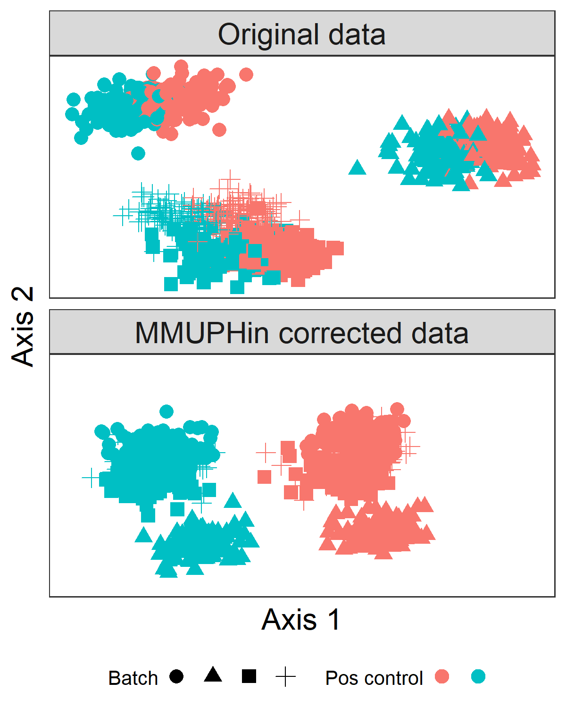

```{r setup, include=FALSE}
knitr::opts_chunk$set(echo = TRUE)
knitr::opts_chunk$set(cache = FALSE)
```

# Introduction

`MMUPHin` is an R package implementing meta-analysis methods for microbial 
community profiles. It has interfaces for: a) covariate-controlled batch and 
study effect adjustment, b) meta-analytic differential abundance testing, and meta-analytic discovery of c) discrete (cluster-based) or d) continuous 
unsupervised population structure.

Overall, `MMUPHin` enables the normalization and combination of multiple 
microbial community studies. It can then help in identifying microbes, genes, 
or pathways that are differential with respect to combined phenotypes. Finally, 
it can find clusters or gradients of sample types that reproduce consistently 
among studies.

# Installation

MMUPHin is a Bioconductor package and can be installed via the following 
command.

```{r Installation, eval = FALSE}
if (!requireNamespace("BiocManager", quietly = TRUE))
    install.packages("BiocManager")
BiocManager::install("MMUPHin")
```

This vignette is intended to provide working examples for all four 
functionalities of `MMUPHin`. 

MMUPHin can be loaded into R with the first `library()` command shown below. We also load some utility packages for data manipulation and visualization.

```{r, message=FALSE}
library(MMUPHin)
library(magrittr)
library(dplyr)
library(ggplot2)
```

# Input data

As input, `MMUPHin` requires a properly 
formatted collection of microbial community studies, with both feature 
abundances and accompanying metadata. Here we use the five published 
colorectal cancer (CRC) 
stool metagenomic studies, incorporated in @thomas2019metagenomic. 
Data for the studies are already
conveniently packaged and accessible through the Biocondcutor package 
`r BiocStyle::Biocpkg("curatedMetagenomicData")`,
though additional wranglings are needed to format input for `MMUPHin`. 

Importantly, `MMUPHin` asks that feature abundances be provided as a 
feature-by-sample matrix, and the metadata be provided as a data frame. 
The two objects shoud agree on sample IDs, that is, `rowname` of the feature 
abundance matrix and `colname` of the metadata data frame must agree. 
Many popular 'omic data classes in R already enforce this standard, such as 
`ExpressionSet` from `r BiocStyle::Biocpkg("Biobase")`, or `phyloseq` from
`r BiocStyle::Biocpkg("phyloseq")`.

To minimize users' efforts in loading data to run the examples, we have properly
formatted the five studies for easy access. The feature abundances
and metadata can be loaded with the following code chunk. For the 
interested user, the commented out scripts were used for accessing data directly
from `r BiocStyle::Biocpkg("curatedMetagenomicData")` and formatting. It might
be worthwhile to read through these as they perform many of the common 
tasks for preprocessing microbial feature abundance data in R, including 
sample/feature subsetting, normalization, filtering, etc.

```{r load data}
data("CRC_abd", "CRC_meta")
CRC_abd[1:5, 1, drop = FALSE]

CRC_meta[1, 1:5]

table(CRC_meta$studyID)

```

# Performing batch (study) effect adjustment with `adjust_batch`

`adjust_batch` aims to correct for technical study/batch effects in microbial
feature abundances. It takes as input the feature-by-sample abundance matrix, 
and performs batch effect adjustment given provided batch and optional covariate variables. It returns the batch-adjusted abundance matrix. Check `help(adjust_batch)` for additional details and options. This figure from the paper (figure 2b) shows the desired effect of the batch adjustment: batch effects are removed, making the effect of the biological variable of interest easier to detect.

```{r echo=FALSE}

```

Here we use `adjust_batch` to correct for differences in the five studies, 
while controlling for the effect of CRC versus control (variable 
`study_condition` in `CRC_meta`). 

`adjust_batch` returns a list of multiple outputs. The part we are most interested in now is the adjusted abundance table, which we assign to `CRC_abd_adj`.

```{r adjust_batch}

fit_adjust_batch <- adjust_batch(feature_abd = CRC_abd,
                                 batch = "studyID",
                                 covariates = "study_condition",
                                 data = CRC_meta,
                                 control = list(verbose = FALSE))

CRC_abd_adj <- fit_adjust_batch$feature_abd_adj
```

One way to evaluate the effect of batch adjustment is to assess the total
variability in microbial profiles attributable to study differences, before
and after adjustment. This is commonly known as a PERMANOVA test 
[@tang2016permanova], and can be performed with the `adonis` function in 
`r BiocStyle::CRANpkg("vegan")`. The inputs to `adonis()` are indices of microbial compositional dissimilarity.

```{r permanova}
library(vegan, quietly = TRUE)

D_before <- vegdist(t(CRC_abd))
D_after <- vegdist(t(CRC_abd_adj))

set.seed(1)
fit_adonis_before <- adonis(D_before ~ studyID, data = CRC_meta)
fit_adonis_after <- adonis(D_after ~ studyID, data = CRC_meta)
print(fit_adonis_before)
print(fit_adonis_after)
```

We can see that, before study effect adjustment, study differences can expalin
a total of 
`r round(fit_adonis_before$aov.tab["studyID", "R2"] * 100, digits = 2)`% of the
variability in microbial abundance profiles, whereas after adjustment this was
reduced to 
`r round(fit_adonis_after$aov.tab["studyID", "R2"] * 100, digits = 2)`%, though
the effect of study is significant in both cases.

# Meta-analytical differential abundance testing with `lm_meta`

One of the most common meta-analysis goals is to combine association effects 
across batches/studies to identify consistent overall effects. `lm_meta` 
provides a straightforward interface to this task, by first performing 
regression analysis in individual batches/studies using the well-validated
`r BiocStyle::Biocpkg("Maaslin2")` package, and then aggregating results with 
established fixed/mixed effect models, realized via the 
`r BiocStyle::CRANpkg("vegan")` package. Here, we use `lm_meta` to test for
consistently differential abundant species between CRC and control samples 
across the five studies, while controlling for demographic covariates (gender,
age, BMI). Again, lm_meta returns a list of more than one components.
meta_fits provides the final meta-analytical testing results. See
help(lm_meta) for the meaning of other components.

```{r lm_meta}
fit_lm_meta <- lm_meta(feature_abd = CRC_abd,
                       batch = "studyID",
                       exposure = "study_condition",
                       covariates = c("gender", "age", "BMI"),
                       data = CRC_meta,
                       control = list(verbose = FALSE))

meta_fits <- fit_lm_meta$meta_fits
```

You'll note that this command produces a few error messages. This is because for one of the studies the specified covariates were not measured. As the message states, these covariates are not included when analyzing data from that study.

We can visualize the significant (FDR q < 0.05) species associated with CRC in
these studies/samples. Comparing them with Figure 1b of @thomas2019metagenomic, 
we can see that many of the significant species do agree.

```{r significant differential abundant species}
meta_fits %>% 
  filter(qval.fdr < 0.05) %>% 
  arrange(coef) %>% 
  mutate(feature = factor(feature, levels = feature)) %>% 
  ggplot(aes(y = coef, x = feature)) +
  geom_bar(stat = "identity") +
  coord_flip()
```

# Identifying discrete population structures with `discrete_discover`

Clustering analysis of microbial profiles can help identify meaningful 
discrete population subgroups [@ravel2011vaginal], but must be carried out
carefully with validations to ensure that the identified structures are 
consistent [@koren2013guide]. `discrete_discover` provides the functionality to 
use prediction strength [@tibshirani2005cluster] to evaluate discrete 
clustering structures within individual microbial studies, as well as a 
"generalized prediction strength" to evaluate their reproducibility in 
other studies. These jointly provide meta-analytical evidence for
(or against) identifying discrete population structures in microbial profiles.
Check `help(discrete_discover)` to see more details on the method and additional
options. We can contrast discrete structure (clusters) with continuous structure (which will be overviewed in the next section):

```{r echo=FALSE}

```


The gut microbiome is known to form gradients rather than discrete clusters 
[@koren2013guide]. Here we use `discrete_discover` to evaluate clustering 
structures among control samples in the five stool studies. It's worth noting that this function takes a distance/dissimilarity matrix as an input, rather than the abundance table.

```{r discrete_discover}

control_meta <- subset(CRC_meta, study_condition == "control")
control_abd_adj <- CRC_abd_adj[, rownames(control_meta)]

D_control <- vegdist(t(control_abd_adj))
fit_discrete <- discrete_discover(D = D_control,
                                  batch = "studyID",
                                  data = control_meta,
                                  control = list(k_max = 8,
                                                 verbose = FALSE))
```

The `internal_mean` and `internal_sd` components of `fit_discrete` are matrices
that provide internal evaluation statistics (prediction strength) for each 
batch (column) and evaluated number of clusters (row). Similarly, 
`external_mean` and `external_sd` provide external evaluation statistics (
generalized prediction strenght). Evidence for existence of discrete structures
would be a "peaking" of the mean statistics at a particular cluster number. 
Here, for easier examination of such a pattern, we visualize the results 
for the largest study, ZellerG_2014. Note that visualization  for all studies
are by default automatically generated and saved to the output file 
"diagnostic_discrete.pdf".

```{r visualize discrete structure}
study_id = "ZellerG_2014.metaphlan_bugs_list.stool"

internal <- data.frame(K = 2:8,
                       statistic = fit_discrete$internal_mean[, study_id],
                       se = fit_discrete$internal_se[, study_id],
                       type = "internal")

external <- data.frame(K = 2:8,
                       statistic = fit_discrete$external_mean[, study_id],
                       se = fit_discrete$external_se[, study_id],
                       type = "external")

rbind(internal, external) %>% 
  ggplot(aes(x = K, y = statistic, color = type)) +
  geom_point(position = position_dodge(width = 0.5)) + 
  geom_line(position = position_dodge(width = 0.5)) +
  geom_errorbar(aes(ymin = statistic - se, ymax = statistic + se),
                position = position_dodge(width = 0.5), width = 0.5) +
  ggtitle("Evaluation of discrete structure in control stool microbiome (ZellerG_2014)")
```

The decreasing trend for both the internal and external statistics along with
number of clusters (K) suggests that discrete structures cannot be 
well-established. To provide a positive example, we examine the two vaginal
microbiome studies provided by `r BiocStyle::Biocpkg("curatedMetagenomicData")`,
as the vaginal microbiome is known to have distinct subtypes 
[@ravel2011vaginal]. Again, we pre-formatted these datasets for easy access,
but you can recreate them from `r BiocStyle::Biocpkg("curatedMetagenomicData")`
with the commented out scripts.

```{r discrete_discover vaginal}
data("vaginal_abd", "vaginal_meta")
D_vaginal <- vegdist(t(vaginal_abd))

fit_discrete_vag <- discrete_discover(D = D_vaginal,
                                      batch = "studyID",
                                      data = vaginal_meta,
                                      control = list(verbose = FALSE,
                                                     k_max = 8))

hmp_id = "HMP_2012.metaphlan_bugs_list.vagina"
data.frame(K = 2:8,
           statistic = fit_discrete_vag$internal_mean[, hmp_id],
           se = fit_discrete_vag$internal_se[, hmp_id]) %>% 
  ggplot(aes(x = K, y = statistic)) +
  geom_point() +
  geom_line() +
  geom_errorbar(aes(ymin = statistic - se, 
                    ymax = statistic + se), 
                width = 0.5) +
  ggtitle("Evaluation of discrete structure in vaginal microbiome (HMP_2012)")
```

We can see that for the vaginal microbiome, `discrete_discover` suggests the 
existence of five clusters. Here we examine only the internal metrics of
HMP_2012 as the other study (FerrettiP_2018) has only 
`r sum(vaginal_meta$studyID == "FerrettiP_2018.metaphlan_bugs_list.vagina")`
samples.

# Identifying continuous population structures with `continuous_discover`

Population structure in the microbiome can manifest as gradients rather than
discrete clusters, such as dominant phyla trade-off or disease-associated
dysbiosis. `continuous_discover` provide functionality to identify such
structures as well as to validate them with meta-analysis. We again evaluate
these continuous structures in control samples of the five studies.

Much like adjust_batch and lm_meta, continuous_discover also takes as input feature-by-sample abundances. The `control` argument offers many tuning parameters and here we set one of them, `var_perc_cutoff`, to 0.5, which asks the method to include top principal components within each batch that in total explain at least 50% of the total variability in the batch. See `help(continuous_discover)` for more details on the tuning parameters and their interpretations.

```{r continuos_structre}
fit_continuous <- continuous_discover(feature_abd = control_abd_adj,
                                      batch = "studyID",
                                      data = control_meta,
                                      control = list(var_perc_cutoff = 0.5,
                                                     verbose = FALSE))
```

We can visualize the identified continuous structure scores in at least two 
ways: first, to examine their top contributing  microbial features, to get an 
idea of what the score is characterizing, and second, to overlay the continuous
scores with an ordination visualization. Here we perform these visualizations
on the first identified continuous score.

```{r visualize continuous structure}
loading <- data.frame(feature = rownames(fit_continuous$consensus_loadings),
                      loading1 = fit_continuous$consensus_loadings[, 1])

loading %>%
    arrange(-abs(loading1)) %>%
    slice(1:20) %>%
    arrange(loading1) %>%
    mutate(feature = factor(feature, levels = feature)) %>%
    ggplot(aes(x = feature, y = loading1)) +
    geom_bar(stat = "identity") +
    coord_flip() +
    ggtitle("Features with top loadings")

mds <- cmdscale(d = D_control)
colnames(mds) <- c("Axis1", "Axis2")
as.data.frame(mds) %>% 
  mutate(score1 = fit_continuous$consensus_scores[, 1]) %>% 
  ggplot(aes(x = Axis1, y = Axis2, color = score1)) +
  geom_point() +
  coord_fixed()
```

From ordination we see that the first continuos score indeed represent strong
variation across these stool samples. From the top loading features we can 
see that this score strongly represents a Bacteroidetes (the *Bacteroides* 
species) versus Firmicutes (the *Ruminococcus* species) tradeoff.

# Sessioninfo
```{r sessioninfo}
sessionInfo()
```

# References